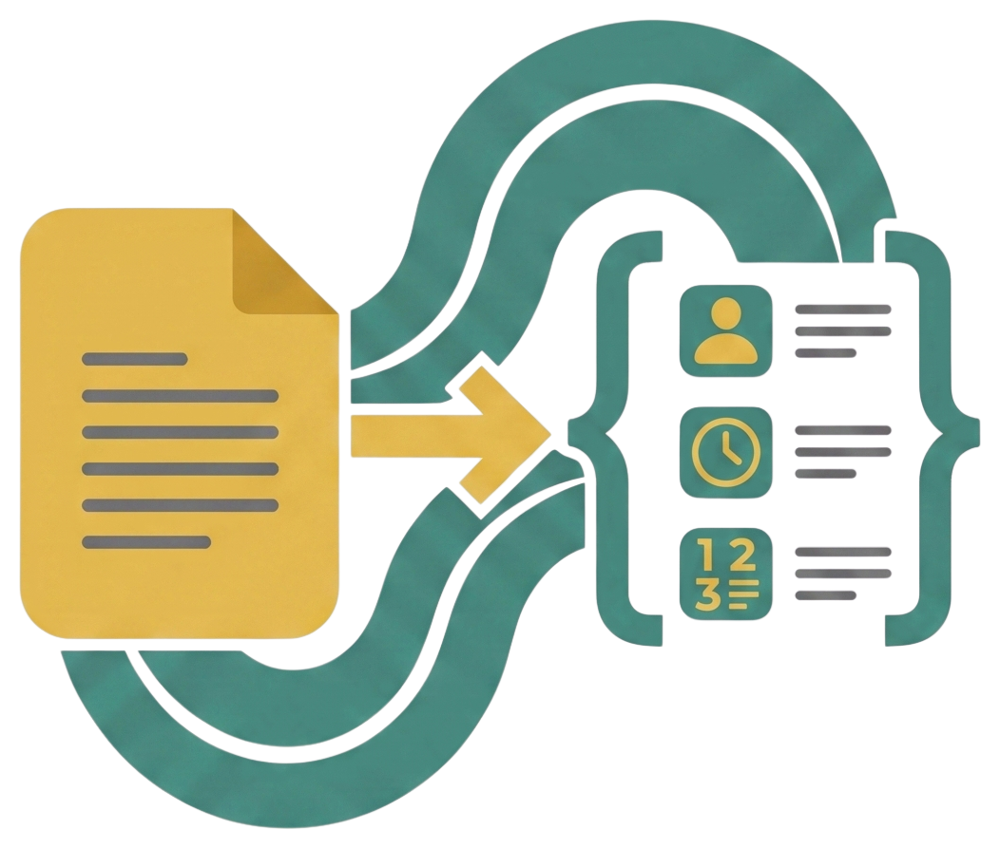

<div style="text-align: center; padding: 2.5rem 0 1.5rem;">
  
  <h1 style="font-family: 'Space Grotesk', sans-serif; font-size: 2.8rem; font-weight: 700; margin: 0.5rem 0 0.25rem; letter-spacing: -0.02em;">schematize</h1>
  <p style="font-size: 1.1rem; color: var(--md-default-fg-color--light); max-width: 560px; margin: 0 auto;">Automated extraction-schema generation using a multi-agent LangGraph pipeline.</p>
</div>

**schematize** turns a natural language research question into a typed, validated extraction schema, ready to drive structured information extraction from document collections.

Instead of hand-crafting a JSON schema, you describe what you want to extract. The pipeline asks clarifying questions, drafts a schema, refines it against quality criteria, tests it against real documents from your corpus, and opens a chat so you can make final adjustments.

**See it in action first:** browse the [worked examples](examples/index.md) — three real, unedited pipeline runs, each run through five different LLMs.

## Why schematize?

Hand-crafting an extraction schema means guessing at fields, missing edge cases, and only finding out when extraction quality is poor. Asking an LLM for a schema once is better, but you still get an untested first draft with no critique loop and no contact with your real data.

schematize closes that loop: clarify → draft → criteria-based refinement → data-grounded refinement against retrieved documents → interactive chat. The result is a Pydantic model you can plug straight into extraction.

## Key features

- Five-stage pipeline: clarification, query generation, criteria-based refinement, data-grounded refinement, and interactive chat.
- Model-agnostic. Any LangChain `BaseChatModel` works, and the built-in setup speaks the OpenAI-compatible API — official OpenAI, LiteLLM, vLLM, Ollama, and many others — see [Configuration](configuration.md#llm-access).
- Data connectors are pluggable — implement one async method, or use the bundled HuggingFace and Weaviate adapters.
- Typed output. Schemas are Pydantic models, so they plug directly into an extractor.
- An expert-question coverage evaluator is included, so you can score how well a schema answers the questions your domain experts actually care about.

## Quick look

Any object with an async `__call__(query, max_docs)` is a valid retriever, so you can get a first
schema without standing up a vector store:

```python
from langchain_openai import ChatOpenAI
from schematize import SchemaGenerator, load_prompts


class MyRetriever:
    async def __call__(self, query: str, max_docs: int = 100) -> list:
        return [{"text": "The court awarded 15,000 PLN for breach of personal rights..."}]


llm = ChatOpenAI(model="gpt-4o")
generator = SchemaGenerator(
    llm=llm,
    retriever=MyRetriever(),
    **load_prompts(language="en", system_type="law"),
)

state = generator.stream_graph_updates(
    "Study personal-rights violations and assess their severity."
)
print(state["current_schema"])
```

For real corpora, swap in the bundled [HuggingFace](guides/huggingface.md) or [Weaviate](guides/weaviate.md) adapter.

## What you get

A generated schema is a typed spec — field names, types, descriptions, and enums:

```python
{
    "fields": [
        {"name": "violation_type", "type_": "enum", "enum_name": "ViolationType",
         "enum_values": ["privacy", "reputation", "image", "bodily_integrity"],
         "description": "Category of personal right that was violated."},
        {"name": "severity", "type_": "integer",
         "description": "Severity of the violation on a 0–5 scale."},
        {"name": "compensation_awarded", "type_": "boolean",
         "description": "Whether monetary compensation was granted."},
    ]
}
```

Convert it to a Pydantic model and use it for extraction:

```python
from schematize import SchemaFields, DynamicModelFactory

model_cls = DynamicModelFactory()(SchemaFields(**state["current_schema"]))
```

## Next steps

- [Install the library](installation.md)
- [Follow the quickstart](quickstart.md)
- [Understand the pipeline](pipeline.md)
- [Write a custom retriever](guides/custom-retriever.md)
- [Evaluate a schema](guides/evaluation.md)
- [Use the command-line runners](guides/cli.md)
- [Browse the API reference](api/schema_generator.md)
