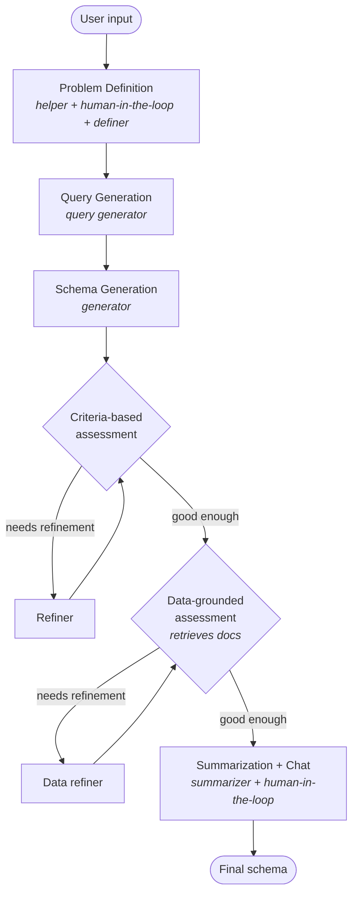

# Pipeline

`SchemaGenerator` orchestrates a five-stage LangGraph pipeline. Each stage runs one or more LLM agents with a single responsibility. Stages communicate through a shared [`AgentState`](api/state.md) — a typed dictionary that accumulates outputs across the graph.



---

## Stage 1 — Problem Definition

The user states an information need in free text. A **helper agent** surfaces implicit assumptions by asking a short batch of clarifying questions — about scope, jurisdiction, variable granularity, and intended analysis. The user answers at the terminal (a human-in-the-loop step), and a **problem-definer agent** compiles the exchange into a formal problem definition that drives every subsequent stage.

**Skip:** Set `skip_problem_definition=True` to bypass this stage. The raw user input is used directly as the problem definition.

---

## Stage 2 — Query Generation

A **query-generator agent** reads the formal problem definition and produces search queries describing the documents the schema will eventually be applied to. These queries are not shown to the user — they are used internally by the data-grounded refinement stage to retrieve matching documents.

---

## Stage 3 — Schema Generation and Criteria-Based Refinement

A **generator agent** drafts an initial extraction schema from the problem definition: typed fields with names, descriptions, and enumerations where appropriate.

The schema then enters an iterative refinement loop:

1. An **assessment agent** scores the schema against explicit quality criteria: coverage of the problem definition, field clarity and non-redundancy, appropriate typing and granularity, and extractability.
2. A **refiner agent** applies the suggested changes.
3. The loop repeats until no further changes are needed, or `max_refinement_rounds` is reached (but always runs at least `min_refinement_rounds` times).

This loop relies only on model critique — it is fast but cannot verify whether the schema fits actual documents.

**Skip:** Set `skip_refinement=True` to skip the assessment/refinement loop and go straight from generation to the next stage.

---

## Stage 4 — Data-Grounded Assessment and Refinement

The second loop grounds the schema in real documents. Using the generated queries, a **data-assessment agent** calls the `DocumentRetriever` to fetch matching documents. It then attempts to populate the schema from each document, reporting where fields are unfillable, ambiguous, or missing for information the document clearly contains.

A **merger agent** consolidates the per-document assessments into a single revision set, and a **data-refiner agent** updates the schema. The loop runs between `min_data_refinement_rounds` and `max_data_refinement_rounds` rounds.

This stage is the most expensive because each round scales with document count × refinement iterations. Control the cost with:

| Parameter | Default | Effect |
|-----------|---------|--------|
| `data_assessment_top_k` | 50 | Documents retrieved per query |
| `data_assessment_num_examples` | 3 | Documents assessed per round |
| `max_data_refinement_rounds` | 3 | Upper bound on loop iterations |
| `min_data_refinement_rounds` | 2 | Minimum loop iterations |

**Skip:** Set `skip_data_grounded=True` to skip this stage entirely.

---

## Stage 5 — Summarization and Interactive Chat

A **summarizer agent** produces a short report explaining how the schema was derived — which fields were added or changed in each loop and why — so the result is auditable rather than opaque.

The session then enters an open-ended chat. The user can ask for further changes in natural language, and a **chat agent** edits the schema in place. The loop continues until the user signals they are done.

---

## Refinement stopping rules

Both loops share the same stopping logic:

```
if rounds < min_rounds → always refine
if needs_refinement and rounds < max_rounds → refine
else → advance to next stage
```

Setting `min_rounds == max_rounds` forces an exact number of iterations regardless of the assessment verdict.
